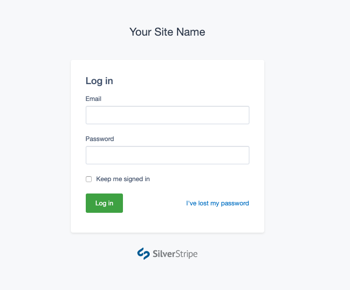

# Silverstripe Login Forms

[](https://github.com/silverstripe/silverstripe-login-forms/actions/workflows/ci.yml)
[](https://www.silverstripe.org/software/addons/silverstripe-commercially-supported-module-list/)

## Overview

The [Silverstripe Login Forms module](https://github.com/silverstripe/silverstripe-login-forms) provides templates for the login screen.

Silverstripe CMS defaults to using the standard `Page.ss` template for login forms,
and is usually customised through the `Layout/Security.ss` template.
This module overrides any template or theme inheritance,
and uses its own `Security.ss` template, in order to provide consistent
styling and behaviour that's independent from the specifics in your project.
This enables more sophisticated login styling, such
as multi-factor authentication through [silverstripe/mfa](https://github.com/silverstripe/silverstripe-mfa).



## Installation

```sh
composer require silverstripe/login-forms
```

## Usage

### Customising your brand

Even though this template is generic, it's often a good idea
to add your own logo in order to make your login forms
more recognisable for your users. This can also help
to prevent generic phishing attempts.

Define an `app/templates/Includes/AppBrand.ss` template
and add your own logo. Example:

```html

```

### Replacing templates

In the unlikely case that you want to re-introduce some customisations
into this new template, you can give priority to your own project templates
(`$default`), or your theme templates.

```yml
---
Before:
  - '#login-forms'
---
SilverStripe\LoginForms\EnablerExtension:
  login_themes:
    - '$default'
    - 'mytheme'
```

Caution: Replacing the `Security.ss` template is not recommended,
since it might change in the future.

### Dark mode ###

The login form includes a dark mode by default for users who prefer it. However,
if your site is not designed for dark mode yet, you can disable this
functionality by disabling it in your yaml configuration:

```yml
SilverStripe\Security\Security:
  enable_dark_mode: false
```

## Contributing

Contributions are welcome! Create an issue, explaining a bug or propose development
ideas. Find more information on
[contributing](https://docs.silverstripe.org/en/contributing/) in the
Silverstripe CMS developer documentation.

## Reporting Issues

Please [create an issue](https://github.com/silverstripe/silverstripe-login-forms/issues/new)
for any bugs you've found, or features you're missing.
