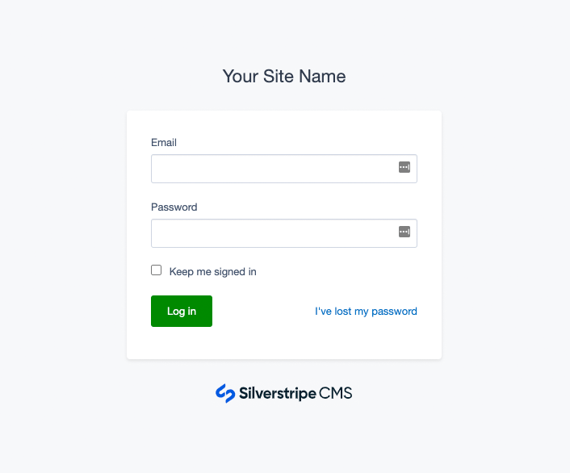

# SilverStripe Login Forms

[](https://travis-ci.org/silverstripe/silverstripe-login-forms)
[](https://scrutinizer-ci.com/g/silverstripe/silverstripe-login-forms/?branch=master)
[](https://codecov.io/gh/silverstripe/silverstripe-login-forms)
[](https://www.silverstripe.org/software/addons/silverstripe-commercially-supported-module-list/)

## Overview

The [SilverStripe Login Forms module](https://github.com/silverstripe/silverstripe-login-forms) provides templates for the login screen.

SilverStripe defaults to using the standard `Page.ss` template for login forms,
and is usually customised through the `Layout/Security.ss` template.
This module overrides any template or theme inheritance,
and uses it's own `Security.ss` template, in order to provide consistent
styling and behaviour that's independent from the specifics in your project.
This enables more sophisticated login styling, such
as multi-factor authentication through [silverstripe/mfa](https://github.com/silverstripe/silverstripe-mfa).



## Requirements

### Installation

Install the package via composer.
```
composer require silverstripe/login-forms
```

The module is enabled by default.

## Usage

### Customising your brand

Even though this template is generic, it's often a good idea
to add your own logo in order to make your login forms
more recogniseable for your users. This can also help
to prevent generic phishing attempts.

Define an `app/templates/Includes/AppBrand.ss` template
and add your own logo. Example:

```html

```
 
### Replacing templates

In the unlikely case that you want to re-introduce some customisations
into this new template, you can give priority to your own project templates
(`$default`), or your theme templates.

```yml
---
Before:
  - '#login-forms'
---
SilverStripe\LoginForms\EnablerExtension:
  login_themes:
    - '$default'
    - 'mytheme'
```

Caution: Replacing the `Security.ss` template is not recommended,
since it might change in the future.

## Contributing

Contributions are welcome! Create an issue, explaining a bug or propose development ideas. Find more information on
[contributing](https://docs.silverstripe.org/en/contributing/) in the SilverStripe developer documentation.

## Reporting Issues

Please [create an issue](https://github.com/silverstripe/silverstripe-login-forms/issues) for any bugs you've found, or features you're missing.
